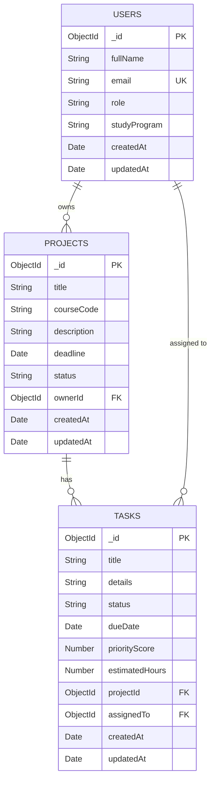

# Database ERD

## Diagram (Mermaid notation)

## Collections

### users
Stores student information. Each user has a `studyProgram` field which is a custom domain-specific field reflecting what program they are enrolled in.

### projects
Represents student projects tied to a specific course. Each project has an `ownerId` referencing a user who leads the project.

### tasks
Individual work items within a project. Each task references both a `projectId` (which project it belongs to) and `assignedTo` (which user is responsible).

## Relationships
- `projects.ownerId` → `users._id` (many-to-one: many projects can have the same owner)
- `tasks.projectId` → `projects._id` (many-to-one: many tasks belong to one project)
- `tasks.assignedTo` → `users._id` (many-to-one: many tasks can be assigned to one user)
